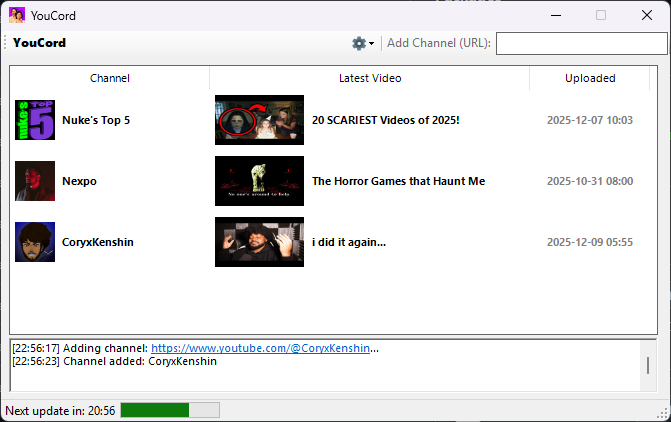

## YouCord
YouTube to Discord, YouTube Channel Latest Video Notifier

This basically solves my needs without needing to do it in Python. Well, I know it's a better alternative but... I prefer this, lol.

- You provide the Discord Webhook
- Add channels by typing them on the textbox
- It will automatically check for channel latest content every 30 minutes.

